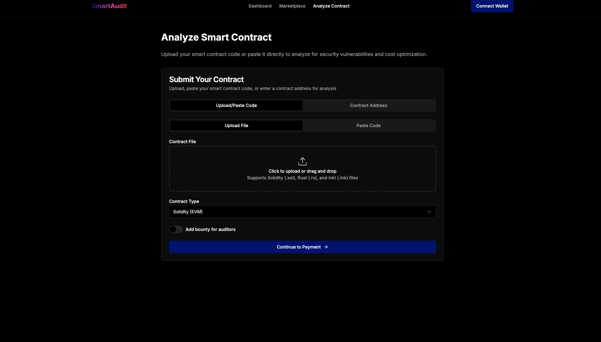

# web3-smart-audits

This application leverages the following tools and technologies:

- **Solidity**: For writing and deploying smart contracts on the Ethereum blockchain.
- **Web3.js**: A JavaScript library for interacting with the Ethereum blockchain.
- **Node.js**: A runtime environment for executing JavaScript code server-side.
- **Hardhat**: A development environment for compiling, testing, and deploying smart contracts.
- **Ethers.js**: A library for interacting with Ethereum wallets and contracts.
- **OpenZeppelin**: A library of secure and community-vetted smart contract templates.
- **Mocha & Chai**: For writing and running unit tests for smart contracts.
- **Git**: For version control and collaboration.
- **VS Code**: A code editor with extensions for Solidity and JavaScript development.
- **Markdown**: For documentation and README creation.

These tools collectively enable efficient development, testing, and deployment of secure smart contracts.

## Project Images

Below are some images showcasing the project:

